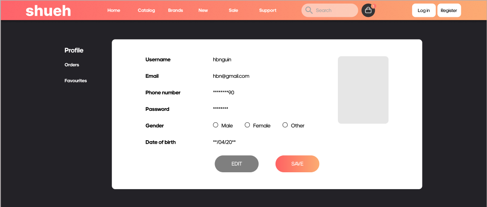
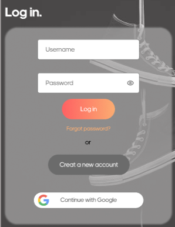
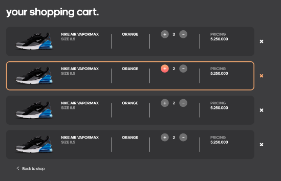
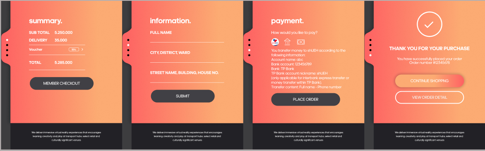

# Shueh - Trang web bán giày

Shueh là một trang web bán giày trực tuyến được xây dựng với mục tiêu mang lại trải nghiệm mua sắm giày dễ dàng và thú vị. Người dùng có thể duyệt qua các mẫu giày, xem chi tiết sản phẩm và thêm vào giỏ hàng để mua sắm trực tuyến.

## 🚀 Tính năng nổi bật

- **Giao diện người dùng đẹp mắt**: Thiết kế hiện đại với giao diện thân thiện và dễ sử dụng.
- **Danh mục sản phẩm**: Xem, tìm kiếm và lọc các sản phẩm theo các tiêu chí khác nhau.
- **Chi tiết sản phẩm**: Hiển thị hình ảnh, giá và thông tin chi tiết cho từng sản phẩm.
- **Giỏ hàng**: Thêm sản phẩm vào giỏ hàng và theo dõi các mục đã chọn.
- **Tối ưu cho các thiết bị di động**: Đảm bảo trải nghiệm người dùng tốt trên cả máy tính và điện thoại di động.

## 📂 Cấu trúc thư mục

```plaintext
├── BackEnd-ASP.NET          # Thư mục chứa code của BackEnd ASP.NET
│   ├── Controller            # Chứa các controller của API
│   ├── Data                  # Thư mục quản lý dữ liệu và cấu trúc database
│   ├── Middleware            # Chứa các Customize Middleware cho BackEnd
│   ├── Migrations            # Quản lý các bản ghi migration
│   ├── Models                # Chứa các mô hình dữ liệu
│   ├── ProjectServices       # Dịch vụ liên quan đến dự án
│   ├── Properties            # Thuộc tính của dự án
│   ├── Repositories          # Repository để quản lý các truy vấn dữ liệu
│   ├── Services              # Các dịch vụ hỗ trợ xử lý logic
│   ├── Utilities             # Chứa các tiện ích chung
│   └── wwwroot/images        # Lưu trữ các tệp ảnh tĩnh của ứng dụng
├── FrontEnd-ReactJS/webshoes # Thư mục chứa code của FrontEnd ReactJS
│   ├── public                # Tệp HTML chính và tài nguyên công khai
│   ├── server                # Các tệp liên quan đến server cho React
│   ├── src                   # Chứa các thành phần chính của ứng dụng
│   │   ├── admin             # Quản lý giao diện quản trị
│   │   │   ├── components    # Các component riêng cho phần admin
│   │   │   ├── pages         # Các trang của phần admin
│   │   │   ├── AdminClient.scss # File SCSS cho giao diện admin
│   │   │   └── data.jsx      # Dữ liệu giả phục vụ kiểm thử
│   │   ├── config            # Cấu hình chung cho ứng dụng
│   │   ├── layouts           # Quản lý các bố cục (layout) chính
│   │   │   ├── admin         # Layout cho trang quản trị
│   │   │   └── user          # Layout cho trang người dùng
│   │   ├── user              # Quản lý giao diện người dùng
│   │   │   ├── components    # Các component riêng cho phần người dùng
│   │   │   ├── hooks         # Chứa các hook tùy chỉnh cho người dùng
│   │   │   └── pages         # Các trang cho giao diện người dùng
│   │   ├── App.jsx           # Thành phần chính của ứng dụng
│   │   ├── App.scss          # File SCSS cho toàn bộ ứng dụng
│   │   ├── App.test.js       # File test cho ứng dụng
│   │   ├── index.css         # CSS cơ bản cho ứng dụng
│   │   ├── index.js          # Điểm vào chính của ứng dụng
│   │   ├── logo.svg          # Logo của ứng dụng
│   │   └── reportWebVitals.js # Đo lường hiệu suất ứng dụng
└── styles                    # Chứa các tệp SCSS cho giao diện
├── .env                      # Tệp cấu hình môi trường
└── README.md                 # Tệp hướng dẫn sử dụng và cài đặt dự án
```

## 💻 Cài đặt

1. Clone repo về máy của bạn:

```sh
git clone https://github.com/Jiro461/ShUEH-Project.git
```
- Cài đặt NodeJS (https://nodejs.org/en) 

2. Cài đặt các package cần thiết:

```sh
cd *
cd */webshoes
npm install
```
3. Chạy ứng dụng:

```sh
npm start
```
Ứng dụng sẽ khởi chạy tại http://localhost:3000.

4. Cài đặt và khởi động BackEnd (ASP.NET):
- Cài đặt .NET 8.0 (https://dotnet.microsoft.com/en-us/download/dotnet/8.0)
- Mở thư mục BackEnd-ASP.NET trong Visual Studio hoặc IDE hỗ trợ ASP.NET.
```sh
dotnet restore
```
- Trong tệp appsettings.json, cập nhật chuỗi kết nối với cơ sở dữ liệu của bạn. Ví dụ:
```json
"ConnectionStrings": {
  "ShUEH-DB": "Data Source=<Tên DataBase của bạn>; Initial Catalog=ShUEHWeb; MultipleActiveResultSets=True; TrustServerCertificate=True; Trusted_Connection=True;"
}
```
- Chạy migration để tạo cơ sở dữ liệu:
```sh
dotnet ef database update
```
- Chạy dự án BackEnd.
```sh
dotnet run
```
Sau khi đã chạy xong thì tiếp tục thực hiện việc Seeding DataBase
```sh
dotnet run seed
```

## 🛠️ Công nghệ sử dụng


### FrontEnd

- React.js:
React.js là một thư viện JavaScript mạnh mẽ được sử dụng để xây dựng giao diện người dùng (UI) tương tác và hiệu quả. React giúp quản lý trạng thái của ứng dụng một cách dễ dàng thông qua các component. Các component là các khối xây dựng UI độc lập, có thể tái sử dụng và được tổ chức tốt, giúp dễ dàng bảo trì và mở rộng ứng dụng. React sử dụng cơ chế Virtual DOM, giúp tăng tốc độ cập nhật giao diện, mang lại trải nghiệm mượt mà cho người dùng.

- SCSS (Sassy CSS):
SCSS là một phần mở rộng của CSS, cung cấp các tính năng nâng cao như biến (variables), kế thừa (inheritance), và vòng lặp (loops), giúp quản lý và tối ưu hóa CSS dễ dàng hơn. SCSS giúp tổ chức mã CSS trong dự án một cách cấu trúc, dễ hiểu và dễ bảo trì hơn so với CSS thông thường. Điều này đặc biệt hữu ích cho các ứng dụng lớn và phức tạp như Shueh, giúp tạo ra một giao diện nhất quán và có khả năng mở rộng.

### BackEnd
- ASP.NET Core:
ASP.NET Core là một framework mã nguồn mở, đa nền tảng để phát triển các ứng dụng web. Trong dự án này, ASP.NET Core đóng vai trò là backend, cung cấp API và xử lý logic phía server. Với ASP.NET Core, ta có thể xây dựng các RESTful API, kết nối và xử lý dữ liệu từ database, và thực hiện các tác vụ phức tạp khác như quản lý xác thực và phân quyền người dùng. ASP.NET Core cung cấp khả năng mở rộng tốt, bảo mật cao, và hiệu suất tối ưu, giúp ứng dụng dễ dàng phát triển và tích hợp với các dịch vụ khác.

- Entity Framework Core (EF Core):
Entity Framework Core là một ORM (Object-Relational Mapper) mã nguồn mở cho .NET, giúp tương tác với cơ sở dữ liệu một cách hiệu quả và an toàn. EF Core giúp chuyển đổi các đối tượng C# thành các bản ghi trong database và ngược lại, giúp việc làm việc với dữ liệu trở nên dễ dàng hơn mà không cần phải viết các câu lệnh SQL phức tạp. EF Core cũng cung cấp tính năng migration, cho phép quản lý và cập nhật cấu trúc database khi có thay đổi trong mã nguồn, giúp duy trì tính nhất quán giữa mã và dữ liệu. Điều này rất quan trọng khi phát triển ứng dụng web vì nó giúp quản lý và duy trì các bản ghi dữ liệu hiệu quả, cũng như giảm thiểu lỗi.

### Cơ sở dữ liệu
- SQL Server:
SQL Server được sử dụng làm hệ quản trị cơ sở dữ liệu trong dự án này. Với tính năng bảo mật, hiệu suất cao, và khả năng mở rộng, SQL Server rất phù hợp để quản lý dữ liệu của một ứng dụng web bán hàng. SQL Server kết hợp với Entity Framework Core giúp quản lý dữ liệu một cách tự động và hiệu quả, hỗ trợ các tính năng như giao dịch (transactions), sao lưu dữ liệu và khôi phục (backup and restore), giúp bảo vệ dữ liệu người dùng.

##  💻 Features

### Navigation Bar with Responsive Slide show of Products


<br /><br />

### Personal Account Page


<br /><br />

### User Login And User Registration Page


<br /><br />


<br /><br />

### Cart Page


<br /><br />

### Product Checkout


<br /><br />

## 📈 Tương lai phát triển
Một số tính năng có thể được thêm vào trong tương lai:

Tích hợp thanh toán trực tuyến: Hỗ trợ thanh toán qua thẻ ngân hàng hoặc ví điện tử.